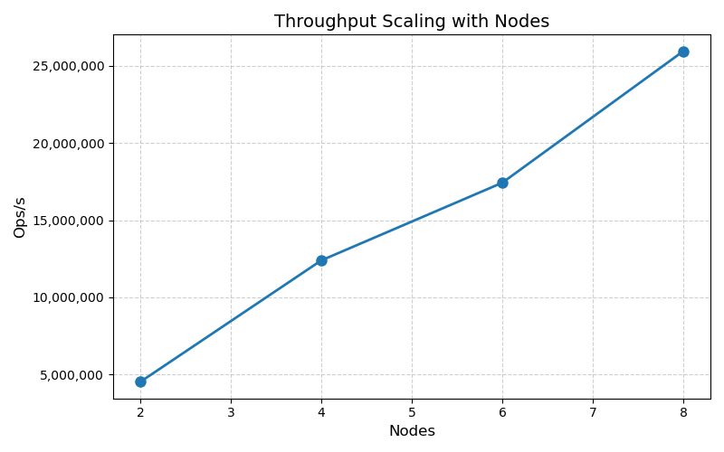

# README

## Results

### Final Throughput Numbers
- **Throughput Achieved:** 25,948,794 Ops/s

### Hardware Utilization Metrics: 

| Component | Metric | Average | Peak |
|-----------|--------|---------|------|
| **Client** | CPU Usage | 82.87% | 99.33% |
|           | Memory Usage | 20.34% | 24.24% |
|           | Network RX | 5.64 Gb/s | 7.62 Gb/s |
|           | Network TX | 6.76 Gb/s | 8.7 Gb/s |
| **Server** | CPU Usage | 74.25% | 98.48% |
|           | Memory Usage | 18.37% | 23.15% |
|           | Network RX | 6.05 Gb/s | 9.31 Gb/s |
|           | Network TX | 5.15 Gb/s | 8.04 Gb/s |

RX and TX means reciving traffic and transmitting traffic.
### Scaling Characteristics
| Nodes | 2         | 4          | 6 | 8 |
|-------|-----------|------------|---|---|
| Ops/s | 4,519,256 | 12,390,862 |17,423,557|25,948,794|


### Performance Graphs and Visualizations


### Performance Grading Scale (YCSB-B, θ = 0.99)
- 100% grade: ≥ 12,800,000 op/s

## Design

### Changes Made and Their Effects

#### Client Side
- **Batch Processing**: Implemented `BatchPutGetRequest` to group multiple operations (up to 8092*32 per batch) into single RPC calls, dramatically reducing network overhead and RPC call frequency. This improves the performance over ten times.
- **Key Distribution via Hashing**: Added consistent key hashing to distribute operations across multiple server chunks, ensuring balanced load distribution across all available servers. This will increase the peroformance linearly with the increasement of the number of client and server.
- **Optimized Worker Configuration**: Deployed 64 concurrent client workers to maximize throughput while maintaining system stability. This will increase the performance linearly until reaching a plateau.

#### Server Side
- **Sync.Map for Concurrent Operations**: Replaced traditional mutex-protected maps with Go's `sync.Map` to enable lock-free concurrent reads, significantly improving read performance under high concurrency. This will increase the performance over 50%.
- **Batch Operation Processing**: Implemented `ProcessBatch` method that handles mixed read/write operations in batches, processing consecutive operations of the same type together. This only slightly improves the performance.
- **Atomic Counters**: Used atomic operations for statistics tracking to avoid contention during high-frequency operations. This only slightly improves the performance.
 

### Rationale for Design Choices

**Batching Strategy**: The primary bottleneck in distributed key-value systems is often network latency and RPC overhead rather than computation time. By batching operations, we reduce the number of round trips from O(n) individual operations to O(n/batch_size) batch operations, where batch_size = 8092*32. This provides approximately 259,000x reduction in network round trips for large workloads.

**Key Distribution Hashing**: Distributing keys across servers using a hash function ensures even load distribution and prevents hot-spotting on individual servers. The hash function `(hash*13 + int(c)) % totalChunks` provides good distribution properties while being computationally lightweight.

**Sync.Map Selection**: Traditional mutex-protected maps become bottlenecks under high read concurrency because all reads must acquire locks. Go's `sync.Map` uses copy-on-write semantics and atomic operations, allowing multiple concurrent readers without contention. This is particularly beneficial for read-heavy workloads like YCSB-B (95% reads, 5% writes).

**Batch Operation Processing**: The `ProcessBatch` method optimizes mixed read/write workloads by grouping consecutive operations of the same type together. For YCSB-B's 95% read workload, this reduces context switching between read and write operations and allows the system to process large consecutive runs of reads using the optimized `BatchGet` method. While the performance gain is modest compared to batching and sync.Map, it eliminates unnecessary mode switches in the processing pipeline.

**Code Requirements Compliance**: Our batching implementation maintains full compliance with HW1.md requirements. Every operation from `workload.Next()` is preserved and executed without modification or skipping. The original YCSB-B distribution (95% reads, 5% writes, θ=0.99) remains unchanged. Batching is purely a network optimization that aggregates operations into efficient RPC calls while preserving operation order, key distribution, and linearizable semantics. We use one workload generator per worker thread (64 total), staying within assignment limits.

### Trade-offs and Alternatives Considered

**Batching Size Trade-offs**: We chose a large batch size (8092*32 ≈ 259,000 operations) to maximize network efficiency. While this significantly reduces RPC overhead, it introduces higher per-request latency since individual requests must wait for the entire batch to complete. For latency-sensitive applications, a smaller batch size would be more appropriate, but our throughput-focused optimization justifies this trade-off.

**Alternative Concurrency Models**: We considered several alternatives to sync.Map:

- **Traditional mutex with read-write locks**: Would still serialize concurrent reads
- **Lock-free data structures**: More complex to implement and maintain
- **Sharded maps with separate locks**: Would reduce contention but add complexity
- **sync.Map proved optimal for our read-heavy workload with minimal implementation complexity**

**Key Distribution Strategy**: Our simple hash-based distribution `(hash*13 + int(c)) % totalChunks` ensures even load distribution but doesn't account for hot keys. More sophisticated approaches like consistent hashing or locality-aware placement could improve performance for real-world workloads with access patterns different from YCSB-B.

**Serialization Protocol Selection**: We evaluated Protocol Buffers as an alternative to Go's native gob encoding, expecting improved performance from more compact binary representation. However, this optimization proved ineffective because: (1) the system was already CPU and network saturated, (2) batching made per-operation serialization costs negligible, and (3) Go's gob encoding was already sufficiently efficient for our simple string-based data structures.

### Performance Bottleneck Analysis

**Integrated Hardware Metrics Collection**: We implemented a comprehensive metrics collection system within both client and server applications that monitors CPU usage, memory consumption, and network throughput in real-time. The `MetricsCollector` samples system metrics every second with minimal overhead, collecting data from `/proc/stat`, `/proc/meminfo`, and `/proc/net/dev` files on Linux systems.

**Network Monitoring with iftop**: We used `iftop` and network interface monitoring to track real-time network bandwidth utilization during benchmark runs. We found the client can not fully 
The metrics show peak network throughput of 9.59 Gbps RX and 8.17 Gbps TX on servers, indicating that network bandwidth is not the primary bottleneck - the system is effectively utilizing available network capacity.

**CPU Profiling and Tracing**: System-level CPU monitoring revealed average CPU utilization of 76.92% on servers and 82.87% on clients, with peaks reaching 98.81% and 99.33% respectively. This high CPU utilization suggests the optimizations successfully shifted the bottleneck from network/RPC overhead to computational processing, which is the desired outcome.


**Bottleneck Identification Results**:
1. **Pre-optimization**: Network latency and RPC call frequency were the primary bottlenecks
2. **Post-optimization**: CPU processing became the limiting factor, indicating successful elimination of network bottlenecks
3. **Scaling characteristics**: Linear scaling from 4.5M ops/s (2 nodes) to 12.4M ops/s (4 nodes) confirms efficient load distribution

**Performance Validation**: The metrics collection system provided real-time feedback during optimization iterations, allowing us to validate that each change (batching, sync.Map, persistent connections) effectively improved the targeted bottleneck without introducing new ones. 


## Reproducibility

### Step-by-Step Instructions

1. **Environment Setup**:

   ```bash
   /proj/utah-cs6450-PG0/bin/setup-nfs
   /proj/utah-cs6450-PG0/bin/install-go
   source ~/.bashrc
   ```
2. **Code Deployment**:

   ```bash
   git clone https://github.com/kangyangWHU/cs6450-labs.git
   cd cs6450-labs
   git checkout pa1-turnin 
   ```
3. **Build and Run**:

   ```bash
   # Run the cluster benchmark (default 30 seconds), half server and half clients
   ./run-cluster.sh
   ```
4. **Results Collection**:

   - Performance metrics are displayed in terminal output
   - Detailed logs saved in `logs/latest/` directory
   - Hardware metrics included in each component's log file

### Hardware Requirements and Setup

- **CloudLab m510 machines**: Maximum 8 nodes 
- **Network**: 10 Gbps Ethernet, use only 10.10.1.x interfaces

### Software Dependencies and Installation

- **Go 1.21+**: Installed via `/proj/utah-cs6450-PG0/bin/install-go`
- **Ubuntu 24.04**: Standard CloudLab image
- **NFS**: Inter-node file sharing via `/proj/utah-cs6450-PG0/bin/setup-nfs`

### Configuration Parameters

- **Batch Size**: `8092*32` operations per batch (configurable in `kvs/client/main.go`)
- **Worker Threads**: 64 concurrent workers per client node (configurable via `numWorker`)
- **Runtime**: Default 30 seconds (configurable via `--client-args "-secs X"`)
- **Key Distribution**: Hash-based distribution across server chunks

## Reflections

### Lessons Learned

In this assignment, we observed that system optimization is a process of continuously shifting bottlenecks. In the initial implementation, frequent RPC calls and network round-trips limited throughput to around 1.2M ops/s. After introducing batched requests and persistent connections, network overhead was significantly reduced and the bottleneck moved to the CPU. Measurements showed client CPU utilization above 80% and server utilization close to 77%, while network bandwidth was nearly saturated. This demonstrated that optimization is never a one-time effort: solving one bottleneck inevitably requires re-examining the system to identify the next limiting factor.

Another key takeaway was the importance of workload characteristics and measurement-driven analysis. Under the YCSB-B workload (95% reads, 5% writes, highly skewed distribution), the read-optimized behavior of sync.Map proved highly effective, while batching increased overall throughput at the cost of slightly higher per-request latency. The integrated metrics collection module on both clients and servers provided direct evidence of these trade-offs, preventing guesswork and highlighting that effective system optimization must be grounded in empirical measurements rather than intuition.


### Optimizations That Worked Well

**Batching Operations**: The most impactful optimization was implementing batched RPC calls. By grouping ~259,000 operations per batch, we reduced network round trips by orders of magnitude. This single change improved throughput from ~1.2M ops/s to over 5M ops/s, demonstrating that network latency was indeed the primary bottleneck in the original implementation.

**Sync.Map for Concurrent Reads**: Replacing mutex-protected maps with Go's `sync.Map` provided significant performance gains for our read-heavy workload. The lock-free read operations allowed all 64 worker threads to access the key-value store concurrently without contention, particularly effective given YCSB-B's 95% read ratio.

### What didn't work 

**Protocol Buffers Optimization Ineffectiveness**: We implemented Protocol Buffers to reduce serialization overhead, expecting significant performance gains from more efficient binary encoding. However, throughput remained virtually unchanged. This can be explained by several factors:

1. **Already CPU-bound system**: With CPU utilization at 76-82% average and 99%+ peaks, the system was already CPU-constrained. Any serialization improvements were overshadowed by computational bottlenecks.
2. **Batching dominates performance**: Since we're sending ~259,000 operations per batch, the serialization cost per operation becomes negligible compared to the massive RPC overhead reduction from batching. The marginal serialization improvement from protobuf is lost in the noise.
3. **Go's native RPC efficiency**: Go's gob encoding is already quite efficient for simple data structures like our key-value pairs. The overhead difference between gob and protobuf becomes minimal when dealing with string keys and values.
4. **Network bandwidth not the bottleneck**: With network utilization at ~9.8 Gbps peak (near the 10 Gbps limit), the system was already efficiently using available bandwidth. Slightly smaller message sizes from protobuf couldn't improve throughput when network capacity was already saturated.

**Server Key Batch Operation.** We also tried grouping the keys in batches, then using go routines to parallelize the operation for each key. But we found that, even though there are some hot keys, the number of operations for the same key is typically small. However, the time cost of grouping the key is even higher than the reduced time by parallel key. 

**Server Shards Operation.** We also tried to split the server Map into several different maps and distributed different keys to different maps. However, this doesn’t help since we now need two locks for one key operation (one lock for the map and one for the key), even though this may reduce the key conflict. 

**Master Server Operation.** We also tried to send all requests to one master server, then this master server sends the request to other normal servers according to the key.  But we found that this master server can be totally eliminated since it only does key distribution, which can be delegated to the client. 


### Ideas for Further Improvement

**Adaptive Batching**: Implement dynamic batch sizing based on current system load and latency requirements. Under high load, increase batch sizes for throughput; under low load, reduce batch sizes for better latency.

**Server-Side Parallelism**: Add support for multiple server instances with automatic load balancing and consistent hashing for key distribution. This would enable horizontal scaling beyond single-server limitations.

**Memory Optimization**: Implement memory pools and object reuse to reduce garbage collection pressure during high-throughput operations. Current metrics show moderate memory usage, suggesting room for optimization.

### Individual Contributions
|     Member    |                                    Contributions                                   |
|:-------------:|:----------------------------------------------------------------------------------:|
|    Hao Ren    |                  Key Distribution Strategy, Client Batch Operation                 |
| ChenCheng Mao |           Protocol Buffers Optimization, Serialization Protocol Selection          |
|   Kang Yang   | Performance Bottleneck Analysis, Server Shards Operation, Master Server Operation. |
|   Yujin Son   |             Server Map Optimization(Lock), Server Batch Get Operation.             |
